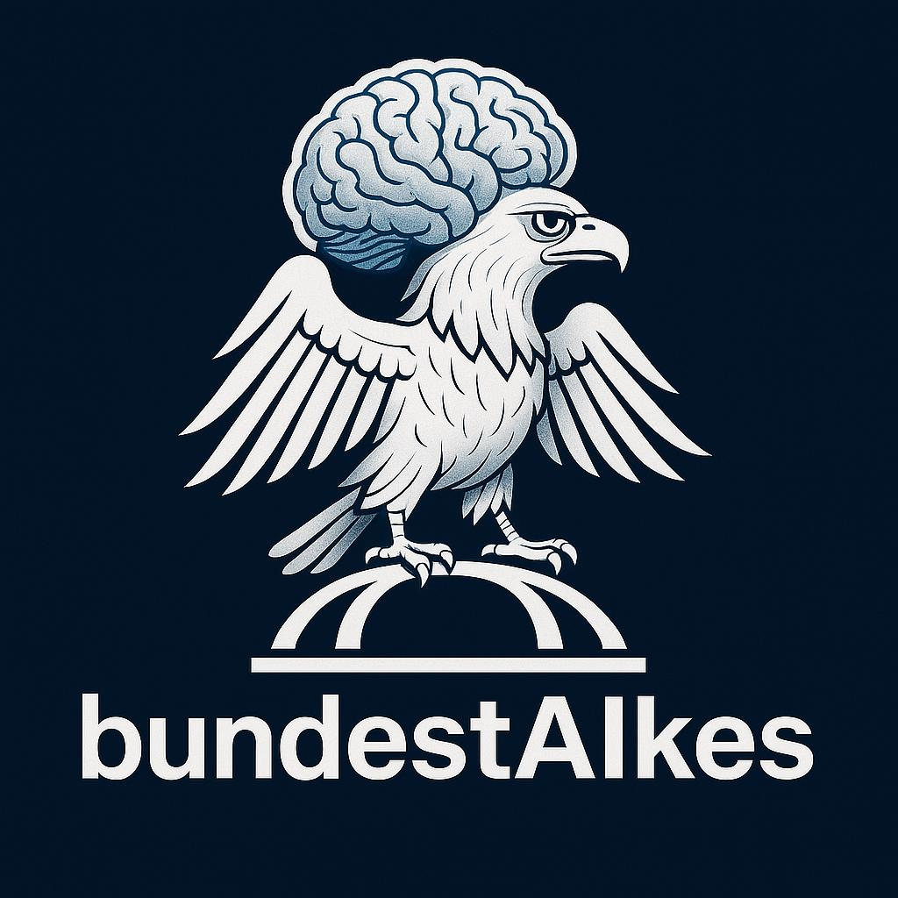
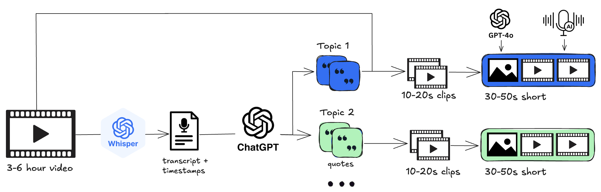

<div align="center">

</img>

### Bundestag Shorts for Gen Z

**Makeathon 2025 Open[AI] Track**

[](https://www.youtube.com/@bundestAIkes)

</div>

## ✨ Inspiration

The Bundestag is the heart of German democracy, yet most citizens don’t know what goes on there. Although [full plenary sessions are publicly available](https://www.bundestag.de/parlamentsfernsehen), they last three to six hours - too long for today’s attention spans. Our project turns these long videos into 30–60 second shorts that capture the key discussion points of the debates. We focus on the respectful discussions that make our democracy work, not on polarizing viewpoints.


## 📋 Project Overview

This project is a fully automated pipeline that turns a 3–6 hour video into several fully produced shorts. The pipeline is powered by the full range of OpenAI API capabilities: from transcribing videos with Whisper, to identifying interesting quotes within vast amounts of text using the long context window of GPT-4.1 and the reasoning power of o4-mini, and finally enriching the shorts via the image-generation and voice APIs. We can’t wait to get our hands on the Sora API once it’s released. Below, you’ll find a simplified architecture diagram of our pipeline.

</img>

## 👀 Have a Look

To put this pipeline into good use, we’ve produced an initial batch of shorts from recent plenary sessions and uploaded them to YouTube. This is just the beginning, we have plenty of ideas to take this prototype even further. Subscribe to our [Youtube Channel](https://www.youtube.com/@bundestAIkes) to join us on this journey. Below, you’ll find a selection of the videos we’ve created.


## 🚧 Challenges

1. **Handling large volumes of transcript text**  
We break down the transcript into the different speaches to reduce the complexity and also the number of input tokens for the LLMs

2. **Selecting the most relevant quotes from hundreds of candidates**
We first gather a broad set of potentially interesting quotes.
We then use ChatGPT-4.1 as a “judge” to evaluate each quote against our predefined criteria.

3. **Extracting the exact video snippet for a given quote**  
Whisper provides timestamps only every 5–10 words, which is too coarse for precise cropping.  
We use Whisper to generate a rough initial snippet, then refine it with AssemblyAI’s API, which offers word-level timestamps for exact trimming.


## 🎬 Make you own Bundestag Shorts

This repository has been tested on Linux and macOS. Before you begin, make sure you have installed:
- Python 3.9 or higher
- ffmpeg (for video/audio processing, see this [installation tutorial](https://www.hostinger.com/tutorials/how-to-install-ffmpeg))
- sox (for audio splitting, see this [installation tutorial](https://madskjeldgaard.dk/posts/sox-tutorial-cli-tape-music/))

Then clone the BundestAIkes repository directly from source and install the packages specified in the `requirements.txt`:

```bash
git clone https://github.com/nifleisch/BundestAIkes.git
cd BundestAIkes

python -m venv venv
source venv/bin/activate
pip install -r requirements.txt
```

Since the pipeline will make several API calls, you must provide keys for both Assembly AI and OpenAI. To do so, create an `.env` file based on `.env.example`. Now you’re all set. The only thing left is a video of a plenary session, desperately waiting to be turned into some nice shorts. Go to the official [Bundestag Mediathek](https://www.bundestag.de/parlamentsfernsehen), click on a plenary session you like, then click the share button at the top right of the video to download it (for testing, we recommend the 1000 kbps setting; at highest resolution, these videos can exceed 15 GB). Once the download finishes, move the .mp4 file into the input folder of this repository. Then start the pipeline by running:

```bash
python prepare_shorts.py <path to .mp4 file>
```

Depending on the session, the pipeline takes between 10–30 minutes. When it’s finished, you’ll find the shorts in the `output` folder.